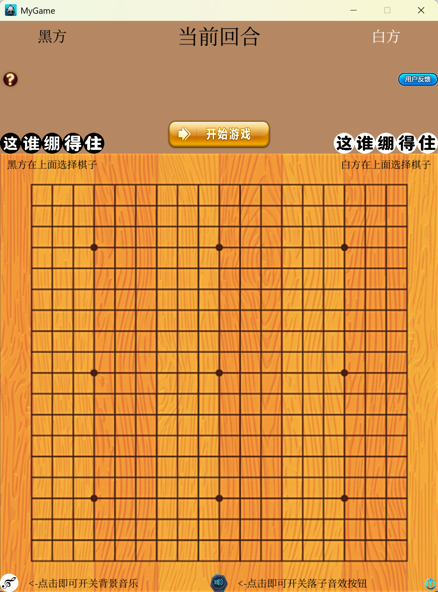
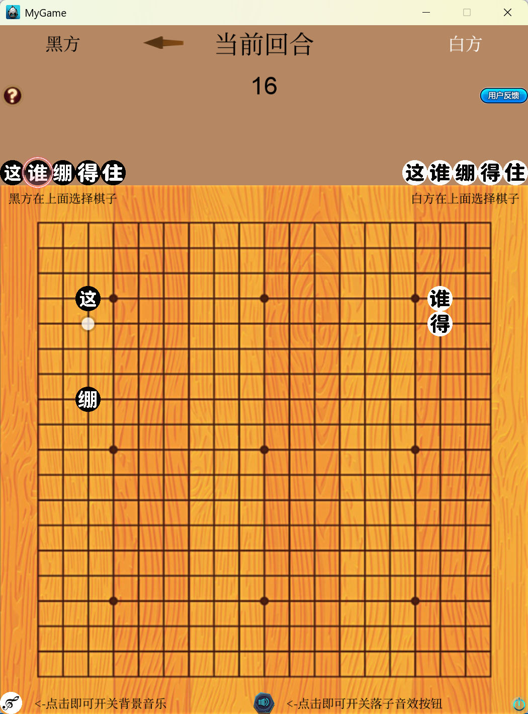
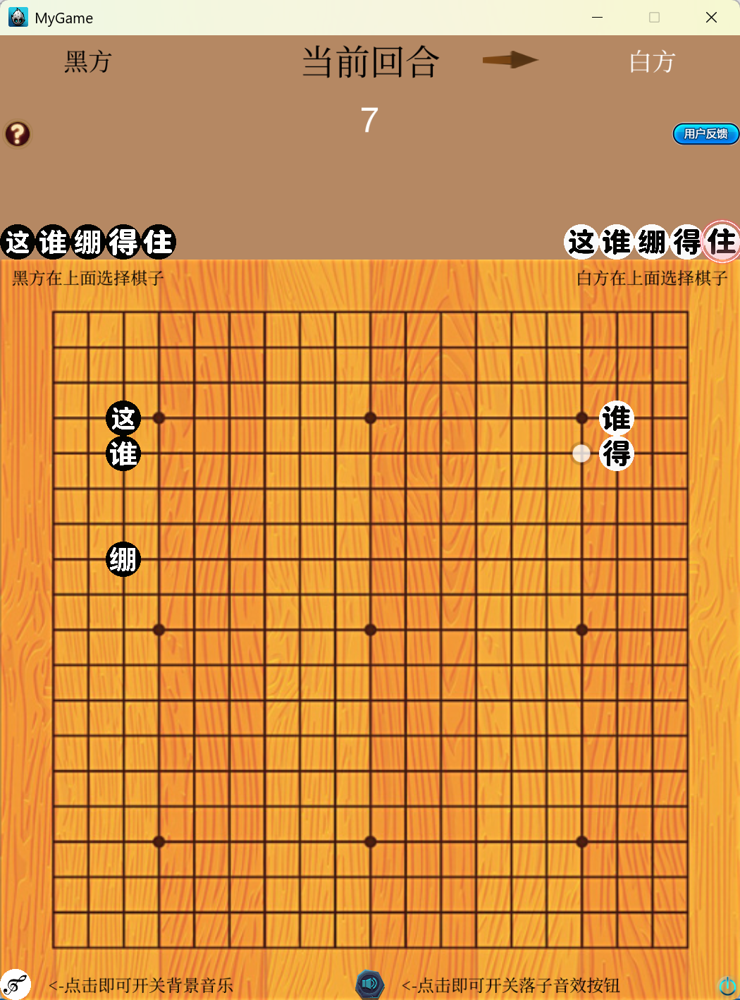
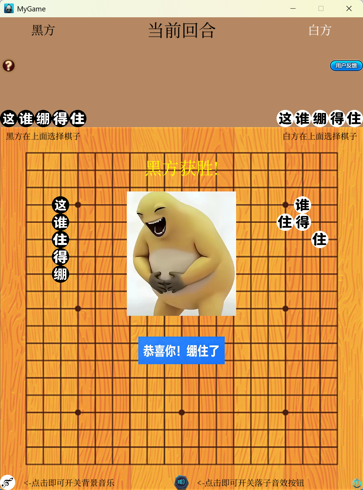

# 五子棋 - “这谁绷得住”

一款基于 Cocos2d-x 开发的五子棋双人对战游戏，在传统五子棋规则上加入了“集字”机制。

---

## 🎮 游戏介绍

本游戏在传统五子棋规则上进行了创新，不再是简单的“五子连珠”，而是要求玩家在落子过程中，通过策略将己方五个不同的棋子 **连成一句特定的五个字**：

> **这 → 谁 → 绷 → 得 → 住**

### 游戏特色

- 黑方和白方各有 5 个棋子，分别印有 **这、谁、绷、得、住**
- 双方轮流落子，每次只能落一个棋子
- **在横、竖、斜任意方向上，集齐 5 个不同字的同一方棋子即获胜！**
- 不要求按顺序连成，只要 5 个字各一个即可
- 每回合限时 20 秒，超时系统自动帮你落子，保证游戏节奏

### 适合谁玩

适合喜欢五子棋、喜欢策略对战的玩家，也适合想学习 Cocos2d-x 游戏开发的同学作为入门项目参考。

---

## 🖼️ 游戏截图

<p align="center">
  
  
  
  
</p>

---

### 温馨提示！

本仓库包含引擎源码及作者本人所添资源和所写源码，故体积偏大

如若本地已有cocos2d-x引擎，可通过cocos new新项目，然后将仓库里Resources文件夹及Classes里项目源码复制到自己项目即可

如若想下载引擎，可通过以下命令克隆官方引擎仓库
```bash
git clone https://github.com/cocos2d/cocos2d-x.git
```
或者访问官方网站下载[https://www.cocos.com/cocos2dx-download](https://www.cocos.com/cocos2dx-download)

**如若不想额外下载引擎，按后面指引即可**

## 📥 下载与运行

### 1. 克隆项目到本地

```bash
git clone https://github.com/ZhengQianXu/New-Creative-Gobang.git
cd New-Creative-Gobang
```

### 2. 安装 CMake（可选）

CMake 用于生成 Visual Studio 项目文件

- **下载地址**：[https://cmake.org/download/](https://cmake.org/download/)
- **推荐版本**：3.19 或更高版本
- **安装选项**：安装时请选择 **"Add CMake to the system PATH for all users"**，这样命令行才能识别 `cmake` 命令

### 3. 生成 VS 项目（如果不装cmake，跳过这一步）

```bash
mkdir build
cd build
cmake .. -G "Visual Studio 17 2022" -A win32
```

**注意**：如果你的 VS 版本不同，请修改 `-G` 参数：

| VS 版本 | CMake 生成器参数 |
| :--- | :--- |
| VS 2022 | `-G "Visual Studio 17 2022" -A win32` |
| VS 2019 | `-G "Visual Studio 16 2019" -A win32` |
| VS 2017 | `-G "Visual Studio 15 2017" -A win32` |

### 4. 打开项目并运行

如果装了cmake，并完成了第3步（生成 VS 项目）
```bash
start MyGame.sln
```
如果没装
```bash
cd proj.win32
start MyGame.sln
```

在 Visual Studio 中：

1. 在右侧 **解决方案资源管理器** 中，右键 `MyGame` 项目
2. 选择 **设为启动项目**
3. 顶部工具栏选择 **Win32** 平台
4. 按 `Ctrl + F5` 或点击 **开始执行（不调试）** 运行

游戏启动后，点击 **开始游戏** 即可对局。

---

## 🛠️ 开发环境

| 工具 | 版本 |
| :--- | :--- |
| 游戏引擎 | Cocos2d-x 3.17.2 |
| 编译器 | Visual Studio 2022 |
| 构建工具 | CMake 3.19+ |
| 脚本语言 | Python 2.7 |
| 系统平台 | Windows 11 |

---

## 📁 项目结构

```
MyGame/
├── Classes/                     # 游戏核心源码
│   ├── AppDelegate.cpp/h        # 应用生命周期管理
│   └── HelloWorldScene.cpp/h    # 游戏主场景（所有游戏逻辑）
├── Resources/                   # 资源文件
│   ├── music/                   # 音频文件（背景音乐、音效）
│   ├── chess/                   # 棋子图片
│   ├── fonts/                   # 字体文件
│   └── *.png                    # 按钮、棋盘、背景等图片
├── proj.win32/                  # Windows 平台入口代码
├── CMakeLists.txt               # CMake 构建配置
└── README.md                    # 项目说明
```

---

## 🎵 音频资源

- 背景音乐：`music/bgm.mp3`
- 落子音效：`music/zhe.mp3`、`music/shui.mp3`、`music/beng.mp3`、`music/de.mp3`、`music/zhu.mp3`
- 胜利音效：`music/victory.mp3`

---

## 📄 开源许可证

本项目采用 **MIT License** 开源协议，你可以自由使用、修改、分发本项目的代码，但需保留版权声明。详情请见 [LICENSE](LICENSE) 文件。

---

## 📧 联系作者

- 作者：ZhengQianXu
- 邮箱：2059984809@qq.com
- GitHub：https://github.com/ZhengQianXu

如果你有任何建议或问题，欢迎提 Issue 或直接联系作者！

---

## 致谢

本游戏使用 Cocos2d-x 引擎开发
Copyright (c) 2010-2017 Cocos2d-x.org
https://www.cocos2d-x.org
