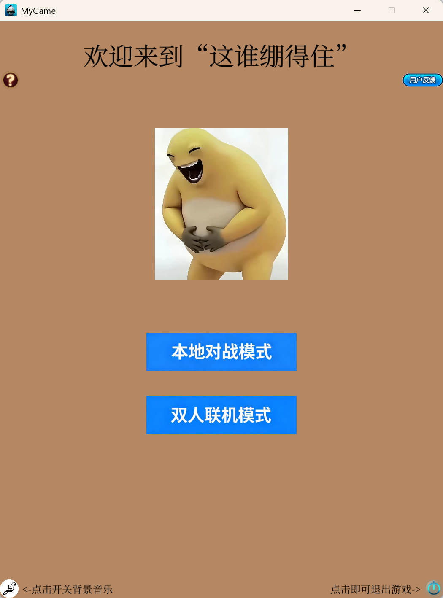
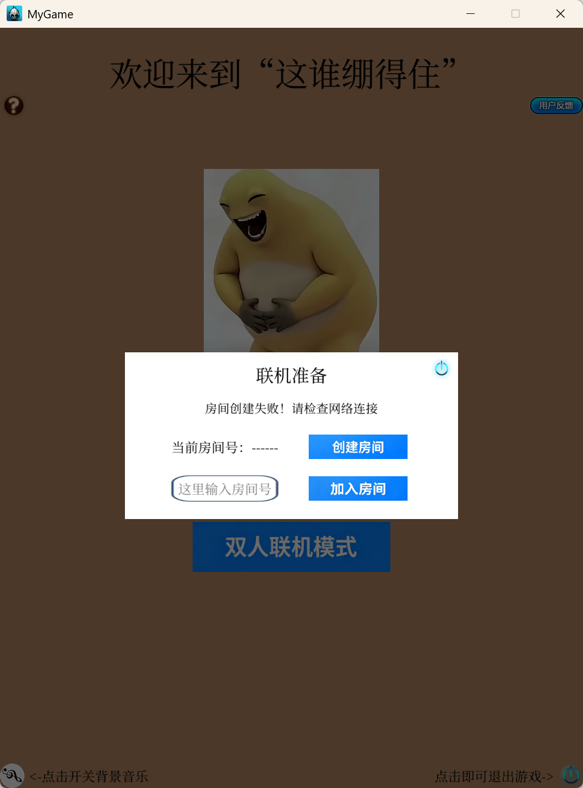
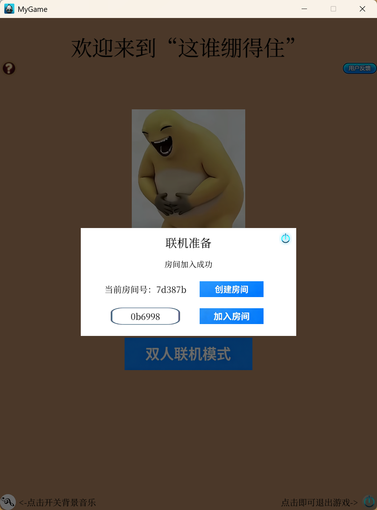
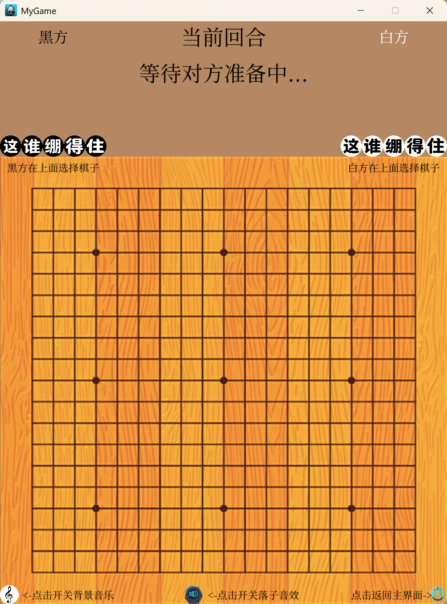
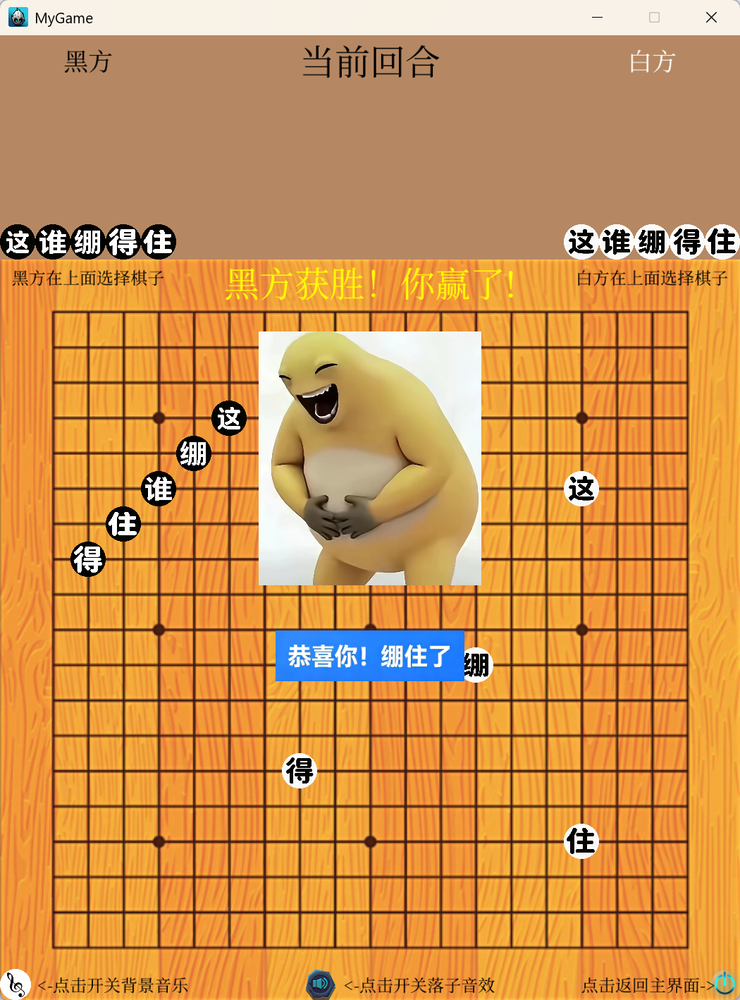
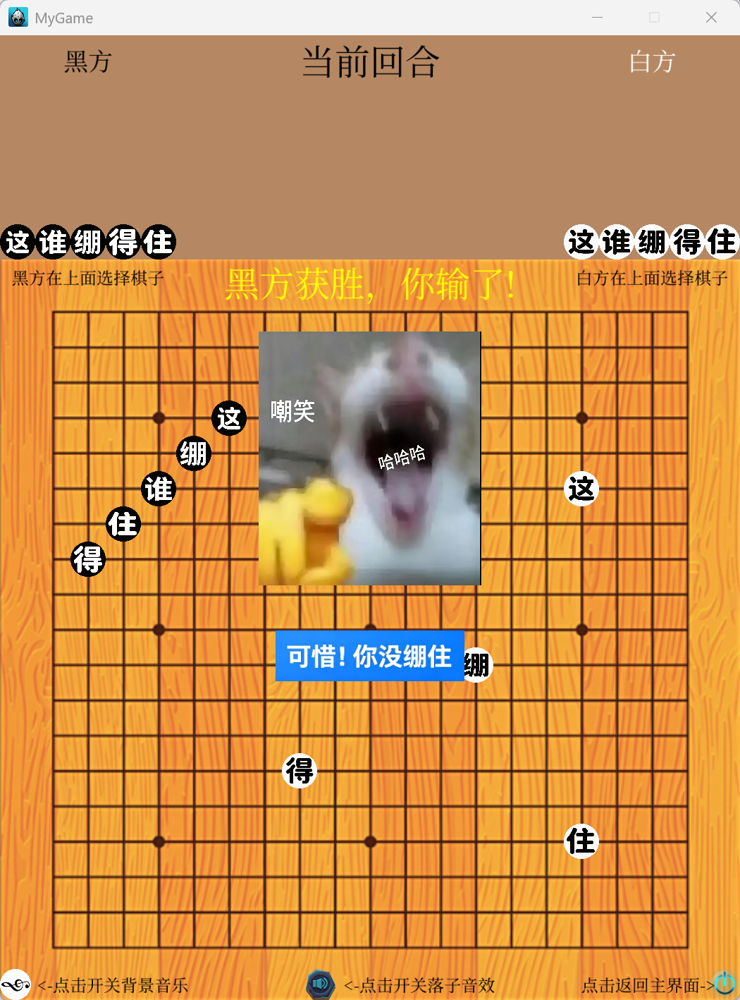

# 这谁绷得住 · 联机版

---

## 项目结构

```
MyGame/
├── Classes/
│   ├── AppDelegate.h/cpp            # 应用入口
│   ├── StartScene.h/cpp             # 主界面
│   ├── LocalModeScene.h/cpp         # 本地双人对战场景
│   ├── OnlineModeScene.h/cpp        # 联机对战场景
│   ├── BoardUI.h/cpp                # 棋盘界面 UI 组件
│   ├── GameLogic.h/cpp              # 游戏逻辑（选中、判赢）
│   ├── PopupUI.h/cpp                # 通用弹窗组件
│   ├── MusicControl.h/cpp           # 背景音乐控制
│   └── NetworkManager.h/cpp         # 网络管理（HTTP + WebSocket）
├── Resources/
│   ├── board.png                    # 棋盘
│   ├── placePoint.png               # 落子点
│   ├── highlight.png                # 选中高亮
│   ├── chess/                       # 棋子贴图
│   ├── music/                       # 音效与背景音乐
│   └── fonts/                       # 字体
├── server.ini                       # 服务器配置
└── mygame_server.py                 # Python 服务端
```

---

## 架构设计

- **UI 与逻辑分离**：`BoardUI` 只负责界面，`GameLogic` 只负责规则，场景类作为协调者
- **回调注入**：`BoardUI` 通过 `std::function` 提供回调接口，不依赖具体场景
- **网络单例**：`NetworkManager` 全局唯一，统一管理 HTTP 和 WebSocket
- **线程安全**：网络回调通过 `performFunctionInCocosThread` 切回主线程
- **服务端权威计时**：回合倒计时由服务端计算并推送，避免两端不一致

---

## 联机流程

```
主界面 → 联机准备弹窗
         ├─ 创建房间 → 拿到房间号 → 连接 WebSocket → 等待对手
         └─ 输入房间号 → 加入房间 → 连接 WebSocket
         ↓
      OnlineMode 场景
         ├─ 双方点击「开始游戏」
         ├─ 落子：发送 move:行,列,棋子名
         ├─ 对手落子：收到 move 消息并渲染
         ├─ 回合时间：服务端推送 update:秒数
         └─ 对手退出：收到 notice:opponentQuit
```

### 服务端房间状态

```
waiting → success → preparing → playing
创建房间  加入成功   进入场景   双方准备，游戏开始
```

---

## 接口

### HTTP

| 接口 | 方法 | 说明 |
|------|------|------|
| `/create_room` | POST | 创建房间，返回 `roomId` |
| `/join_room` | POST | 加入房间，需传 `roomId` |

### WebSocket `/ws`

| 消息 | 方向 | 说明 |
|------|------|------|
| `join:房间号` | 客户端 → 服务端 | 加入房间 |
| `preparing` | 服务端 → 客户端 | 双方已连接，可进入场景 |
| `ready:ok` | 客户端 → 服务端 | 准备就绪 |
| `role:black` / `role:white` | 服务端 → 客户端 | 分配角色 |
| `playing` | 服务端 → 客户端 | 游戏开始 |
| `move:行,列,棋子名` | 双向 | 落子信息 |
| `update:秒数` | 服务端 → 客户端 | 回合剩余时间 |
| `gameOver` | 客户端 → 服务端 | 游戏结算 |
| `notice:opponentQuit` | 服务端 → 客户端 | 对手退出 |

---

## 运行环境

### 客户端

- Cocos2d-x 3.17.2
- Visual Studio 2022（Windows）

### 服务端

- Python 3.8+
- aiohttp

```bash
pip install aiohttp
```

---

## 运行步骤

### 1. 启动服务端

```bash
python mygame_server.py
```

输出如下表示启动成功：

```
======== Running on http://0.0.0.0:8080 ========
(Press CTRL+C to quit)
```

### 2. 配置客户端

修改 `server.ini`（与 `mygame.exe` 同级目录）：

```ini
[server]
host=你的服务器IP
port=8080
```

- 自己电脑测试：需要将`mygame_server.py`里不允许同IP连接的代码段注释掉，然后确保服务端和客户端在同一台电脑，并且host=127.0.0.1
- 局域网测试：填运行服务端电脑的局域网 IP（如 `192.168.1.100`）
- 公网测试：填服务器公网 IP（如`8.155.128.15`）
- 补充：读取服务器IP配置文件的代码在`Classes/NetworkManager.cpp`里，我并没有检查IP字段合法性，所以如果使用了配置文件，请确保IP无误，否则需要自行修改源码；如果不用配置文件也是可行的，源码里默认host=127.0.0.1，不过请不要将`server.ini`放在与`mygame.exe`同级目录。

### 3. 编译运行

用 VS 打开 `proj.win32/MyGame.sln`，编译运行。（记得在解决方案目录下`src/`处添加现有项）

---

## 部署

### 局域网

1. 电脑 A 运行服务端
2. 查看电脑 A 的局域网 IP（`ipconfig`）
3. 电脑 B 的 `server.ini` 填电脑 A 的 IP
4. 确保两台电脑可互通 8080 端口

### 公网

1. 服务端部署到云服务器
2. 开放安全组 8080 端口
3. 客户端 `server.ini` 填服务器公网 IP
4. 如果服务端在 NAT 后，需配置端口转发

---

## 注意事项

- `WebSocket` 对象的释放由 `onClose` 回调负责，`disconnect()` 只发起关闭
- 服务端与客户端的json交流信息是一一对应的，如果修改了其中一处，相对应的另一处也应该被修改，服务端`create_room`对应客户端`onCreateRoomResponse`，服务端`join_room`对应客户端`onJoinRoomResponse`，服务端`start_timer`和`webSocket_handle`对应客户端`onMessage`

---

## 游戏截图

<p align="center">
  
  
  
  
  
  
  
  
</p>

---

## 开源许可证

本项目采用 **MIT License** 开源协议，详情请见 [MIT License](https://opensource.org/license/MIT) 文件。

---

## 作者

- ZhengQianXu
- 邮箱：2059984809@qq.com
- Github：https://github.com/ZhengQianXu

如果你有任何建议或问题，欢迎提 Issue 或直接联系作者！

---

## 致谢

本游戏使用 Cocos2d-x 引擎开发
Copyright (c) 2010-2017 Cocos2d-x.org
https://www.cocos2d-x.org
